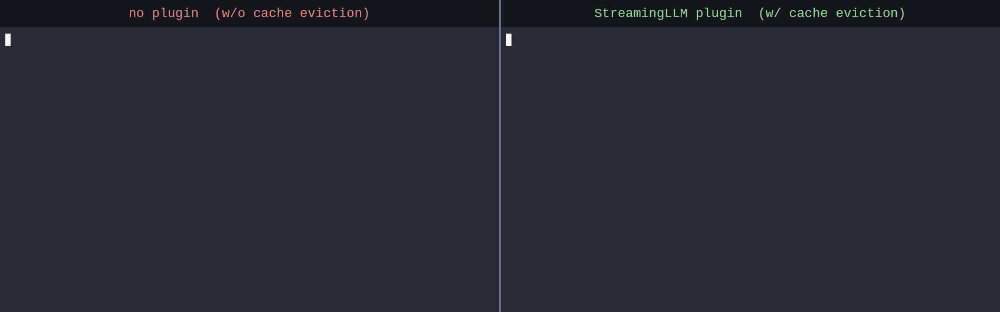

# Argus Engine

[](https://github.com/hedone21/argus-engine/actions/workflows/ci.yml)
[](#라이선스)
[](Cargo.toml)
[](https://github.com/hedone21/argus-engine/releases)

[English](README.md) | **한국어**

**휴대폰·엣지 ARM64 GPU에서 양자화된 Llama·Qwen·Gemma 모델을 돌리고, KV-cache 정밀도
(precision) 포맷은 엔진을 다시 빌드하지 않고 플래그 하나로 바꿉니다.**

Argus는 Android·Linux ARM64 SoC를 겨냥한 Rust 온디바이스 LLM 추론 엔진입니다. NEON CPU와
Adreno-OpenCL·CUDA GPU 백엔드, zero-copy UMA 메모리 경로, KV-cache·precision 연구를 위한
플러그인 확장 표면을 갖췄습니다.

> **상태: 초기 단계.** 주로 검증한 경로는 Adreno·ARM64입니다. 출하되는 `argus-cli`는 단일
> 프롬프트 생성을 합니다. 프롬프트를 넣으면 이어지는 텍스트와 `Decode: X ms/tok` 라인을
> 출력하고, KV-cache 정밀도 포맷 플러그인(`--kv-format`)도 여기서 로드할 수 있습니다.
> KV-cache **eviction stage**(H2O·D2O·StreamingLLM), **KIVI** KV 양자화, tensor partition,
> 런타임 weight swap은 이미 구현하고 검증했지만, v0에서는 `argus-cli`가 아니라 `argus-bench`·
> `argus-eval`로 돌립니다. 멀티턴 **chat** 서버(`argus-chat`, OpenAI 호환 HTTP API)는 CLI와
> 함께 출하됩니다. 이들을 `argus-cli`에 붙이는 작업과 `--profile`은 v1에서 제공할 예정입니다.
> 어떤 기능이 지금 어디서 도는지는 [로드맵](#로드맵) 표에 정리해 두었습니다.

## 데모

폰의 Adreno GPU(Galaxy S25, OpenCL)에서 스트리밍으로 도는 **StreamingLLM KV-cache eviction**.
`--max-seq-len 512`로 제한한 멀티턴 `argus-chat --interactive` 세션입니다. eviction stage가 없으면 KV cache가
차서 오버플로로 생성이 멈추고, `eviction streaming --sink 4 --recent-window 256`을 주면
매 턴 캐시를 프루닝하며 계속됩니다:



<sub>온디바이스 OpenCL에서 토큰 단위 스트리밍으로 녹화(오른쪽 패널은 프루닝 시 `[Chat/Evict] removed=…` 출력).
느린 프리필은 빨리감기, `--profile` 없이 녹화. 재현은 [`docs/demo/`](docs/demo/) 참고.</sub>

## 빠른 시작 — 지금 되는 것

```bash
git clone https://github.com/hedone21/argus-engine.git
cd argus-engine
cargo build --release

# 1. CPU에서 단일 프롬프트 생성 (호스트 기본 백엔드)
./target/release/argus-cli -m model.gguf --prompt "Hello" -n 50 -b cpu

# 2. 같은 프롬프트를 Adreno OpenCL GPU에서 (백엔드는 플래그 하나로 전환)
./target/release/argus-cli -m model.gguf --prompt "Hello" -n 50 -b opencl

# 3. 샘플링 옵션
./target/release/argus-cli -m model.gguf --prompt "Hello" -n 50 \
    --temperature 0.8 --top-p 0.9 --top-k 40 --repetition-penalty 1.1

# 4. KV-cache 정밀도 포맷 플러그인을 런타임에 로드 (엔진 재빌드 없음)
#    (.so는 Linux·Android 이름이고, macOS 호스트 빌드는 .dylib을 만듭니다)
cargo build --release -p example-kv-format --features plugin-cdylib
./target/release/argus-cli -m model.gguf --prompt "Hello" -n 50 \
    --load-plugin target/release/libexample_kv_format.so \
    --kv-format example_kv_format

# 5. 멀티턴 chat — OpenAI 호환 HTTP 서버 (POST /v1/chat/completions)
./target/release/argus-chat -m model.gguf --listen 127.0.0.1:8080
#    다른 셸에서 (SSE 스트리밍 예시; "stream" 빼면 단일 JSON 응답):
curl http://127.0.0.1:8080/v1/chat/completions -H 'content-type: application/json' \
    -d '{"model":"argus","messages":[{"role":"user","content":"Hello"}],"stream":true}'
```

`argus-cli`는 실행할 때마다 이어지는 텍스트와 함께 `TTFT`, `Decode: X ms/tok`, `Avg TBT`
라인을 출력합니다(`argus-chat`은 토큰을 스트리밍하고 OpenAI 형식의 토큰 `usage` 카운트를 돌려줍니다).
`.gguf`만 가리키면 dtype은 자동으로 감지되어 변환할 필요가 없습니다. `tokenizer.json`은 모델
파일 옆에 두거나 `--tokenizer-path`로 지정하세요. CUDA, Android 크로스 컴파일, Safetensors →
GGUF·AUF 변환은 [설치 / 소스에서 빌드](#설치--소스에서-빌드)에 있습니다.

4번이 정밀도 format 플러그인 경로입니다. 로드한 `.so`가 지금도 `argus-cli`의 실제 decode
경로까지 닿습니다. KV-cache eviction 플러그인(`eviction <policy>` 서브커맨드, 예:
`eviction h2o`; 커스텀 stage는 `eviction plugin --name <name>`)과 KIVI 정밀도 패킹은 v0에서
`argus-bench`·`argus-eval`로 돌립니다. 자세한 내용은 [로드맵](#로드맵)을 보세요.

## 무엇을 할 수 있나

**온디바이스 & 빠름**

- **ARM64 최적화** — Android·Linux ARM64 SoC용 NEON + dotprod 인트린식, x86_64 호스트에서는
  AVX2 + FMA.
- **Zero-copy UMA 메모리** — 통합 메모리(UMA) SoC에서 `CL_MEM_ALLOC_HOST_PTR`·DMA-BUF로 GPU
  버퍼를 CPU 포인터에 매핑해 CPU↔GPU memcpy를 없앱니다.
- **GPU flash attention** — GQA 인식, strided.
- **양자화 가중치** — Q4_0·Q8_0 블록 양자화, F16·BF16. GGUF는 바로 로드하고(dtype 자동 감지),
  Safetensors F16·BF16은 로드할 때 변환합니다.

**메모리 적응형 KV cache** *(v0에서는 `argus-bench`·`argus-eval`로 동작, [로드맵](#로드맵)
참고)*

- **Eviction stage** — Sliding Window·H2O·H2O+·D2O(merge 보상)·StreamingLLM을 조합할 수 있는
  `KVCacheStage` 플러그인.
- **KIVI KV 양자화** — 캐시 메모리를 줄이는 동적 Q4·Q8 KV 패킹.
- **Adaptive resilience** *(선택, `resilience` 기능 + `argus-manager`)* — 메모리·발열 압력에
  맞춰 런타임에 적응(eviction, 백엔드 전환, throttle).

**확장성** *(엔진 코어 수정 없음)*

- **플러그형 KV cache·precision** — KV-cache stage·format을 별도 크레이트로 추가해
  `linkme`로 스스로 등록합니다. stage·format 축은 런타임에 `.so`로도 로드할 수 있습니다
  (read stage는 정적 링크 전용). 직교하는 세 축 (**stage** ⊥ **format** ⊥ **hardware**). 정밀도
  format 축(`--kv-format`)과 read stage(`--read-stage`)는 지금 `argus-cli`에서 바로 됩니다.
  [Argus 확장](#argus-확장) 참고.
- **플러그형 백엔드** — CPU(NEON)·OpenCL(Adreno)·CUDA를 아우르는 `Backend` 트레이트.

## Argus는 llama.cpp와 어떻게 다른가

Argus는 [llama.cpp / ggml](https://github.com/ggml-org/llama.cpp)에서 가져온 커널을
재사용하며([THIRD-PARTY-LICENSES](THIRD-PARTY-LICENSES.md) 참고), llama.cpp를 대체하지 않고
보완합니다. llama.cpp가 여러 플랫폼을 폭넓게 지원하는 이식성 위주라면, Argus는 Adreno·ARM64
UMA 엣지 기기에 맞춰 튜닝하고 그 위에 KV-cache·precision 연구용 zero-compile 플러그인
표면을 얹습니다. eviction stage나 KV 정밀도 포맷을 이름만 바꿔 끼우면 되고(**stage** ⊥
**format** ⊥ **hardware**) 엔진을 다시 컴파일하지 않습니다. 휴대폰급 GPU에서 KV-cache나 양자화
기법을 빠르게 실험하고 싶을 때, 이 확장 표면이 Argus를 고를 이유입니다.

## 로드맵

각 기능이 지금(v0) 어디서 도는지 정리했습니다. **v1 예정** 열은 `argus-cli`에
(또는 새 바이너리로) 들어올 기능입니다.

| 기능 | `argus-cli` | `argus-bench` / `argus-eval` | v1 예정 |
|---|:---:|:---:|:---:|
| 단일 프롬프트 생성 (CPU / OpenCL / CUDA) | ✅ | ✅ | |
| 샘플링 (temperature / top-p / top-k / rep-penalty) | ✅ | ✅ | |
| KV-cache 정밀도 포맷 플러그인 (`--kv-format`, `--read-stage`) | ✅ | ✅ | |
| Prefix-cache 저장 / 복원 | ✅ | | |
| KV-cache eviction stage (Sliding / H2O / H2O+ / D2O / StreamingLLM) | | ✅ | ✅ |
| KIVI KV 양자화 (`--kv-mode kivi`) | | ✅ | ✅ |
| Tensor partition (FFN을 GPU + CPU로 분할) | | ✅ | ✅ |
| 런타임 weight swap | | ✅ | ✅ |
| 연산별 프로파일링 (`--profile`) | | | ✅ |
| 대화형 chat REPL | | | ✅ |

> 멀티턴 chat은 이제 `argus-chat`(OpenAI 호환 HTTP 서버, `POST /v1/chat/completions`,
> 스트리밍 + 비스트리밍)으로 출하됩니다. 세 가지 KV 모드(Standard / KIVI / Offload)와
> manager 연동 resilience를 지원하며, `--interactive`로 stdin REPL도 됩니다.

## 지원 모델 · 하드웨어

### 모델

| 패밀리 | 아키텍처 | 소스 포맷 | 양자화 |
|--------|----------|-----------|--------|
| Llama | Llama 계열 (`LlamaForCausalLM`) | GGUF, Safetensors | Q4_0, Q8_0, F16, BF16 |
| Qwen | Qwen2 / Qwen2.5 | GGUF, Safetensors | Q4_0, Q8_0, F16, BF16 |
| Gemma | Gemma / Gemma 2 / Gemma 3 (text) | GGUF, Safetensors | Q4_0, Q8_0, F16, BF16 |

GGUF를 권장합니다(dtype 자동 감지, 로드 시 변환 없음). Safetensors F16·BF16은 로드할 때
변환합니다.

### 하드웨어 백엔드

| 백엔드 | 빌드 | 하드웨어 / 타깃 |
|--------|------|------------------|
| CPU (NEON + dotprod) | 기본 | ARM64 — Android / Linux |
| CPU (AVX2 + FMA) | 기본 | x86_64 — Linux (호스트 / 개발) |
| OpenCL | 기본 (`opencl`) | Adreno GPU — Android ARM64 (프로덕션 경로) |
| CUDA | `--no-default-features --features cuda` | NVIDIA 외장 GPU / Jetson Orin |
| CUDA (임베디드 UMA) | `--features cuda-embedded` | Jetson Xavier |

크로스 컴파일 타깃: `aarch64-linux-android`, `aarch64-unknown-linux-gnu`,
`aarch64-unknown-linux-musl`, `x86_64-unknown-linux-gnu` (`.cargo/config.toml` 참고).

## 사전 요구사항

- **Rust** (stable): `rustup install stable`.
- **OpenCL 헤더** — 기본 빌드는 `opencl` 기능을 켭니다. Linux에서는
  `sudo apt-get install ocl-icd-opencl-dev`. macOS는 OpenCL 프레임워크를 기본 제공합니다.
  빌드에는 GPU가 *필요하지 않고*, GPU 백엔드를 실행할 때만 필요합니다.

## 설치 / 소스에서 빌드

Argus는 소스 형태로 배포합니다. [`argus-shared`](https://github.com/hedone21/argus-shared)를
git 의존성으로 쓰기 때문에 crates.io에는 올라가 있지 않습니다(`cargo install argus-engine`은
동작하지 않습니다). git 체크아웃에서 직접 빌드하세요. 기본 `cargo build --release`와 CPU·OpenCL
실행은 [빠른 시작](#빠른-시작--지금-되는-것)에서 다룹니다.

```bash
# CUDA (NVIDIA 외장 GPU / Jetson) — opencl과 동시에 쓸 수 없음
cargo build --release --no-default-features --features cuda
```

### 모델 변환

Argus는 GGUF를 바로 로드합니다. HuggingFace Safetensors 모델에서 GGUF를 만들거나
AUF(Argus Unified Format) 자산을 빌드하려면 [`scripts/`](scripts/)의 도구를 쓰세요:

```bash
pip install -r scripts/requirements.txt

# Safetensors → GGUF (기본값 Q4_0)
python scripts/convert_safetensors_to_gguf.py models/qwen2.5-1.5b out.gguf

# Safetensors나 GGUF → AUF (한 번에; 필요하면 auf_tool 바이너리도 빌드)
scripts/convert_to_auf.sh --input models/qwen2.5-1.5b/ --output model.auf
```

전체 변환 가이드는 [`scripts/README.md`](scripts/README.md)를 보세요.

### Android (크로스 컴파일 + 배포)

Android NDK로 `aarch64-linux-android`를 빌드합니다. Adreno 프로덕션 경로는 `-b opencl`이고,
기기에는 벤더 `libOpenCL.so`가 필요합니다(여기서 배포하지 않으니 기기의 `/vendor/lib64`에서
가져오세요).

`scripts/run_device.py`가 adb(Jetson은 ssh)로 빌드 → 푸시 → 실행을 자동화합니다. 로컬 설정 파일
두 개로 동작하며, 템플릿은 커밋돼 있고 채워 넣은 사본은 gitignore 처리됩니다:

```bash
cp hosts.toml.example hosts.toml        # NDK 경로 설정
# 또는: python scripts/device_registry.py bootstrap-host   # NDK 자동 탐지
cp devices.toml.example devices.toml    # 기기 등록
# 또는: python scripts/device_registry.py discover         # 연결된 adb 기기 자동 탐지

python scripts/run_device.py --list-devices
python scripts/run_device.py -d android argus-cli \
    --model-path /data/local/tmp/models/model.gguf -b opencl --prompt "Hello"
```

원시 타깃 플래그는 `.cargo/config.toml`을, 디바이스 러너와 평가 도구는
[`scripts/README.md`](scripts/README.md)를 보세요.

## Cargo 기능 (features)

| Feature | 기본 | 설명 |
|---------|------|------|
| `opencl` | ✅ | OpenCL GPU 백엔드 (Adreno) |
| `profile` | ✅ | 연산별 프로파일링 계측 |
| `cuda` | | CUDA 백엔드 (외장 GPU / Jetson) |
| `cuda-embedded` | | 임베디드 UMA용 CUDA (Jetson Xavier) |
| `resilience` | | `argus-manager`와의 D-Bus IPC 연동 |
| `caote` | | CAOTE value-aware eviction 플러그인 |
| `rkv` | | R-KV 결합 eviction 측정 프로토타입 (실험적, 기본 off) |

> `opencl`과 `cuda`/`cuda-embedded`는 동시에 쓸 수 없으니 GPU 백엔드는 정확히 하나만 고르세요.
> 위 CUDA 빌드는 `--no-default-features`로 기본 `opencl`을 빼고 `--features cuda`를 더한
> 것입니다. GPU 백엔드를 하나도 켜지 않는 빌드는 아직 지원하지 않습니다.
>
> `profile` 기능은 연산별 계측을 컴파일하지만, 출하되는 v0 `argus-cli`는 `--profile` 플래그를
> 거부합니다(프로파일 출력은 `argus-bench`에서 봅니다). CLI 프로파일링은 v1 예정입니다.

## Argus 확장

KV-cache 기법(technique)은 `technique-api`와 `linkme`에만 의존하는 별도 크레이트이고, 스스로
등록합니다. 하나 추가해도 엔진 코어 코드는 건드리지 않습니다. 직교하는 세 축
(**stage** ⊥ **format** ⊥ **hardware**)이 있습니다. **stage**는 어떤 토큰을 남길지(eviction/merge),
또는 attention에서 무엇을 읽을지(read stage) 정하고, **format**은 KV 바이트 레이아웃(precision)을
정의합니다.

### 예시: KV-cache 정밀도 플러그인

[빠른 시작](#빠른-시작--지금-되는-것) 4번에서 로드한 그 플러그인입니다.
`crates/techniques/example-kv-format/`를 템플릿으로 복사하면 됩니다. 플러그인 전체가 작은
크레이트 하나입니다:

```
crates/techniques/my-kv-format/
├── Cargo.toml
└── src/lib.rs
```

`Cargo.toml`은 의존성 두 줄에, 로드 가능한 `.so`로 빌드하려고 `cdylib`을 더합니다:

```toml
[package]
name = "my-kv-format"
# version·edition·license는 워크스페이스에서 상속

[lib]
crate-type = ["cdylib", "rlib"]   # cdylib = .so, rlib = 정적 force-link

[dependencies]
technique-api = { path = "../../technique-api" }
linkme = "0.3"

[features]
plugin-cdylib = []                # .so C-ABI export를 켜는 게이트
```

`src/lib.rs`에서 트레이트를 구현하고(여기 `KVFormat`은 이름 + 바이트 레이아웃 디스크립터입니다)
한 줄로 등록합니다:

```rust
use technique_api::{KVFormat, KVLayoutDesc, Packing, ScaleLayout};

struct MyKvFormat;

impl KVFormat for MyKvFormat {
    fn name(&self) -> &str { "my_kv_format" }   // --kv-format 선택자
    fn layout(&self) -> KVLayoutDesc {          // q4_0과 비슷: 32원소 블록, 4비트 nibble
        KVLayoutDesc {
            block_elems: 32,
            bits: 4,
            scale_layout: ScaleLayout::PerBlockF16,
            packing: Packing::Nibble,
        }
    }
}

// 이 한 줄이 정적(linkme 레지스트리)과 동적(`.so` C-ABI export)을 한꺼번에 등록합니다.
technique_api::register_kv_format!("my_kv_format", || Box::new(MyKvFormat));
technique_api::export_plugin!();                // --load-plugin이 쓸 .so 진입점을 만듭니다
```

이제 `.so`로 빌드해 이름으로 로드하면 됩니다. 엔진은 다시 빌드하지 않습니다:

```bash
cargo build --release -p my-kv-format --features plugin-cdylib
./target/release/argus-cli -m model.gguf --prompt "Hello" -n 50 \
    --load-plugin target/release/libmy_kv_format.so --kv-format my_kv_format
```

엔진은 시작할 때 `.so`를 `dlopen`해 포맷을 등록하고, `--kv-format my_kv_format`이 KV cache를 이
레이아웃으로 흘려보냅니다(`[DecodeLoop] kv storage = OPAQUE` 로그가 decode 경로까지 닿았다는
증거입니다). `--features plugin-cdylib`를 빼고 대신 크레이트에 path 의존성 한 줄을 넣으면, 같은
코드가 정적으로 force-link됩니다. `--kv-format my_kv_format`은 그대로이고 `.so`만 사라집니다.

### 다른 축

- **stage**(eviction/merge 종류) — `KVCacheStage::plan(&ctx) -> Option<KVCachePlan>`을 구현해 어떤
  토큰을 `keep`·`merge`할지 돌려주고, `register_kv_stage!`로 등록한 뒤 `eviction plugin --name
  <name>` 서브커맨드(빌트인: `eviction h2o|d2o|streaming|sliding`)로 고릅니다. 템플릿은
  `example-keep-recent`. v0에서 stage는 `argus-cli`가 아니라
  `argus-bench`·`argus-eval`로 돕니다.
- stage의 read 종류(쿼리 인식 읽기) — `KVReadStage`를 구현하고 `--read-stage <name>`으로 고릅니다.
  정적 링크 전용이고 `argus-cli`에서 돕니다. 참고는 `quest` 빌트인.

`KVFormat`이 더하는 것은 연산 커널이 아니라 바이트 레이아웃(디스크립터)뿐입니다. 대응하는 빌트인이
없는 정밀도는 일반 dequant→f32 경로로 처리됩니다. 축 용어는 [`CONTEXT.ko.md`](CONTEXT.ko.md)를,
전체 온보딩 가이드(빠른 시작부터 플러그인 출하까지)는 [`docs/plugins.ko.md`](docs/plugins.ko.md)
를, 간결한 등록 레퍼런스와 `example-*` 템플릿(번들, 멀티 포맷, rollback·에러 vehicle)은
[`crates/technique-api/README.md`](crates/technique-api/README.md)를 보세요.

## 저장소 구성

이 저장소는 **엔진**입니다. Argus는 저장소 세 개로 이뤄집니다:

| 저장소 | 역할 |
|------|------|
| [`argus-engine`](https://github.com/hedone21/argus-engine) | LLM 추론 엔진 (본 저장소) |
| [`argus-shared`](https://github.com/hedone21/argus-shared) | IPC 프로토콜 타입 (manager ↔ engine) |
| [`argus-manager`](https://github.com/hedone21/argus-manager) | 시스템 리소스 관리 서비스 |

## 문서

- [`docs/plugins.ko.md`](docs/plugins.ko.md) — Argus 플러그인 만들기: 엔진을 포크하지 않고
  KV-cache 기법(stage / format / backend-capability)을 더하는 개발자 온보딩 가이드.
- [`CONTEXT.ko.md`](CONTEXT.ko.md) — 도메인 용어집: stage ⊥ format ⊥ hardware 축과 캐시 관리 용어.
- [`AGENTS.md`](AGENTS.md) — AI 코딩 에이전트와 기여자를 위한 가이드.

## 라이선스

[Apache-2.0](LICENSE-APACHE)나 [MIT](LICENSE-MIT) 중에서 골라 쓸 수 있습니다. 따로 명시하지 않는
한, 기여물도 위와 같은 이중 라이선스로 제공됩니다.

이 엔진의 일부는 [llama.cpp / ggml](https://github.com/ggml-org/llama.cpp)과
[jquesnelle/yarn](https://github.com/jquesnelle/yarn)(둘 다 MIT)에서 가져왔습니다. 전체 출처
표기는 [THIRD-PARTY-LICENSES.md](THIRD-PARTY-LICENSES.md)를 보세요.
